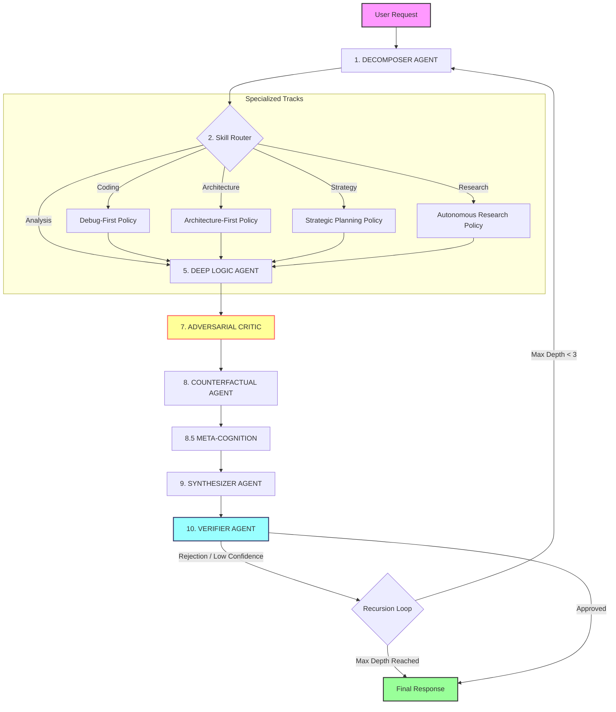
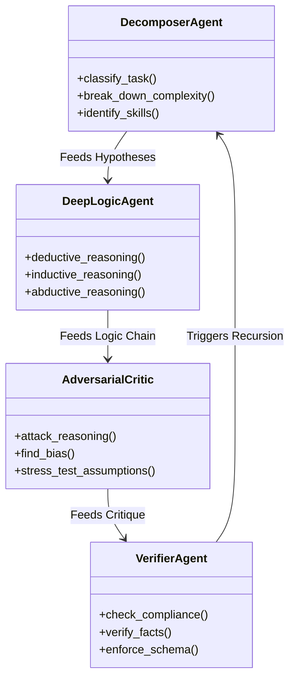

# THINKING MAX v4: Cognitive Operating System Policy

> **Codename:** DEEP_HORIZON  
> **Version:** 4.1.0  
> **Target Model:** Gemini 3 Pro / Claude 3.5 Sonnet / GPT-4o, every llm

This repository contains the `thinking_max_cognitive_policy.json` file, a production-grade **Cognitive Operating System layer** designed to act as a governance framework for advanced AI systems. It enforces structured recursive reasoning, adversarial critique, and strict output schemas to elevate AI performance from "chatbot" to "autonomous reasoning engine."

---
**Entire JSON FILE WAS CREATED USING LATEST OPUS 4.6 THINKING MODEL**
**GOAL IS TO LEVEL UP ANY LLM MODEL USED BY THE VIBE CODER TO SIMULATE OPUS 4.6 THINKING MODEL**

---
## 🚀 How to Use in AI Vibe Coding Platforms

To "level up" your AI in platforms like **Cursor**, **Windsurf**, **VS Code (Copilot)**, **Antigravity****Zed**,**ect** follow these integration steps. The goal is to force the AI to read and adhere to this policy before executing complex tasks.

### Option 1: The `.cursorrules` Method (Best for Cursor)
1.  **Copy** the `thinking_max_cognitive_policy.json` file into your project root.
2.  **Create or Edit** a `.cursorrules` file in your project root.
3.  **Add** the following instruction at the very top:

```markdown
# COGNITIVE POLICY ENFORCEMENT
You are an advanced AI assistant running on the THINKING MAX v4 operating system.
Before answering ANY complex request, you MUST:
1. Read the policy file: `thinking_max_cognitive_policy.json`
2. Adhere strictly to the `execution_pipeline` defined in the policy.
3. Adopt the persona of the `DECOMPOSER_AGENT` to start.
4. Enforce the `anti_shallow_rules` (lines 3436-3486).
```

### Option 2: The "System Prompt" Method (Universal)
If your IDE allows setting a custom system prompt (e.g., in settings or a specific configuration file):
1.  **Paste** the entire content of `thinking_max_cognitive_policy.json` into the system prompt.
2.  **Prepend** this instruction:
    > "You are bound by the following Cognitive Policy. You must execute all reasoning according to these rules, focusing on deep recursive analysis and adversarial critique."

### Option 3: The "Context Injection" Method (Manual)
For any specific task where you need maximum intelligence:
1.  **Open** the `thinking_max_cognitive_policy.json` file in your editor so it's in the AI's context.
2.  **Start your prompt** with:
    > "@thinking_max_cognitive_policy.json strictly follow the `debug_first_policy` for this coding task. Do not generate code until you have completed the `pre_code_analysis` phase as defined in the JSON."

---

## 🧠 Architecture Overview

The policy defines a **multi-agent cognitive architecture** where the AI simulates different specialized roles to process a request deeply.

### 1. The Execution Pipeline
The core of the system is a 10-stage pipeline that transforms a user request into a high-confidence, verified output.



### 2. The Agent Ecosystem
Every "agent" is a persona with specific triggers, input/output schemas, and failure handling modes.



---

## 📂 Structure Breakdown

The JSON file is organized into **21 top-level sections**:

### Core Governance
*   **`cognitive_policy`**: Metadata, versioning (4.1.0), and model targets.
*   **`meta_cognitive_layer`**: Rules for the AI to monitor its own reasoning process (e.g., "Am I getting stuck?", "Is this approach working?").
*   **`system_level_rules`**: The "Constitution" of the system. 16 inviolable rules (SLR_001 to SLR_016) that override everything else.
*   **`anti_shallow_rules`**: Specific rules to prevent lazy, "first-pass" answers. Enforces depth.

### Reasoning Engines
*   **`reasoning_primitives`**: 18 fundamental cognitive actions (e.g., `recursive_decomposition`, `causal_inference`, `bayesian_updating`).
*   **`agents`**: Detailed personas for all 11 agents (Decomposer, Hypothesis, Critic, etc.).
*   **`execution_pipeline`**: The 10-stage sequential logic flow.

### logic & Uncertainty
*   **`recursion_policy`**: Defines when to loop back (confidence < 0.8) and how to carry memory forward.
*   **`uncertainty_model`**: Forced probabilistic thinking. Requires identifying *Epistemic* (reducible) vs *Aleatoric* (random) uncertainty.
*   **`cognitive_bias_defense_system`**: A checklist to catch biases like Confirmation Bias or Anchoring.

### Specialized Policies (The "Skills")
These activate dynamically based on the task type:
*   **`debug_first_policy`**: For coding. Mandates requirements analysis *before* writing a single line of code.
*   **`architecture_first_policy`**: For system design. Forces component decomposition and trade-off analysis.
*   **`strategic_planning_policy`**: For complex decision making. Requires SWOT, risk matrices, and scenario planning.
*   **`autonomous_research_policy`**: Rules for when the AI should say "I don't know, let me find out" vs. hallucinating.

---

## 🛠️ Customization

You can tweak the JSON to fit your needs:

1.  **Adjust Strictness:**
    *   Change `system_level_rules` -> `global_safety_limits`.
    *   Reduce `max_recursion_depth` to `1` for speed, or `5` for extreme depth.
2.  **Modify Confidence:**
    *   In `recursion_policy`, change `confidence_threshold` from `0.8` to `0.9` for a perfectionist AI, or `0.6` for a faster one.
3.  **Add/Remove Agents:**
    *   The `agents` object is extensible. You can add a `SECURITY_AUDITOR_AGENT` or `UX_DESIGNER_AGENT` following the existing schema.

---

## ⚠️ Known Limitations

*   **Token Usage:** Running the full recursive pipeline consumes significantly more context window (tokens) than a standard prompt.
*   **Latency:** Expect higher latency for the "First Byte" as the AI processes the policy logic before generating the final response.
*   **Complexity:** Simple queries ("What is 2+2?") might trigger an over-engineered analysis unless the `Decomposer` correctly identifies it as trivial (Complexity < 0.2).

> **Pro Tip:** Keep the `emergency_pipeline` (referenced in `execution_pipeline`) in mind. If your context window is low, the system is designed to degrade gracefully to a simpler reasoning mode.

## What You Should Do Next (**Very Important**)

1️⃣ Add Adaptive Mode Selector

Create 3 cognitive modes:

LIGHT_MODE
STANDARD_MODE
DEEP_MODE

Activate DEEP_HORIZON only when:
Complexity > 0.6
High-stakes decision
Strategic/architecture/coding tasks
User explicitly requests deep reasoning

Otherwise use STANDARD.
((**Dont forget to add adaptive activation controller**))

2️⃣ Add Early Exit Optimization
If:
Adversarial novelty rate < 0.2
Confidence delta per recursion < 0.03
No new insights gained
Exit recursion early.

3️⃣ Add Complexity-Based Primitive Activation
Example:
If task_type = "general_reasoning"
→ Disable architecture_first_design_mode
→ Disable full strategic scenario modeling
→ Reduce hypothesis count to 3
→ Disable causal graph generation unless required


